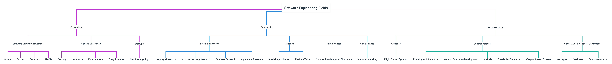
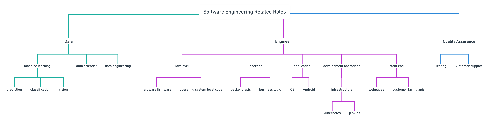

# Spare Change for Software [DRAFT]

> This is a work in progress but figured it's worth sharing unedited now before I take 
  several months to getting around to polishing it  

Having professionally practiced the art of software development :tm: for a little under half a decade 
I feel I'm now poised to foist unsolicited advice to anyone considering a career in or completely orthogonal
to the field. To that end I'll cover my pitch for software, my view of the field and, my advice based off of that
view, and finally my _humble_ _expert_ opinion(s). 

## Software and You
I'll start by making a bold, perhapses overly hyperbolic, claim that of all the engineering disciplines 
and arguably all disciplines software engineering offers the largest career entropy. In other words you'll 
have a hard time finding a profession that you can master almost entirely with an internet connection and
then be compensated on the same order of magnitude as the surgeons and attorneys of the world. Beyond 
a phatty pay check the types of problems solved by software and the problem solving you'll need to master
to solve them lend themselves to a large number of other professions. Get tired of coding and like people 
move to sales, want to have a large impact move up the ladder by ping poning to product and or engineering
leadership, want to solve more technically challenging problems use the capital you've amassed and get an
other degree or even better get your employer to pay for it. Enjoy teaching? There are massive amounts of 
opportunities to give back to the community from teaching after work college courses to retiring at 30 and
teaching highschool. 

All this to say for all the benefits a career or starting career in software affords you need to have 
some disposition for it. But software is such a massive field there's likely a way you'll be able to 
mold your passions and proficiencies to _some_ aspect of the field.    

## The Map and the Terrain
Software is a massive field trying to quantify it in one blog post is likely impossible and probably
not useful. But I'll briefly outline my half-ass 10,000 foot view of it.

In my mind, from a career perspective, there are three major catagories you can end up working in. 
(non-profits is arguably another but the distinction between career and hobby is more hazy). I've been
fortunate over my internships and two employment stints to dabble in each. I'll outline my view of the pros
and cons each _could_ have.

Field                      
- Commercial / Public Sector  
    - Pros
      - Higher general compensation
      - Simple to get into
      - Likely using newer tech 
      - Wide variety of lifestyle options
    - Cons
      - Less likely to work on something impactful 
      - Job security can be hard to reason about  
    - Notes
      - Most people end up working here and the types of work you
        can find are extremely varied. 
    - Advice
      - One thing my dad told me about a career in the Army and Army reserves is that
        the quickest way to get promoted is to be on the front lines where the action is.
        The same holds true for picking a career if you want to grow the most and _earn_ the most
        gravitate towards companies that are tech focused and ideally where software _is_ the 
        main product of the company. 
      - Bootstrap a career at a startup. Startups are know for long hours and statistically lower pay.
        But you'll be hard-pressed to find any other environment that will alow you to grow as quickly.
        Startups tend to attract, in my limited experience, passionate engineers and working with limited
        resources forces you to be a better engineer. Moreover startups often can't hire for every role that's
        needed. As a result you'll be able to work on projects you likely wouldn't be given at a larger organization. After a few years and some buzz words on your resume you'll have a very easy time
        moving to a different organization if you want. 
        
- Academia                    
    - Pros
      - Likely more meaningful problems
      - Obtaining a PhD can help in landing very lucrative research positions at
        large organizations 
      - Good opportunities to teach 
    - Cons
      - Very poor compensation unless you lead a research group or move out of academia
      - Politics 
      - Securing funding is an art and will likely be prioritized over teaching
    - Notes
      - A career in academia requires a special degree of passion the hours will be long and 
        the pay isn't great but if you love learning and discovery this is likely the best way 
        to satiate that drive.
    - Advice
      - Talk to actual people in academia, they'll likely have a more accurate pros and cons list. 

- Governmental                
    - Pros
      - Problems _could_ be interesting
      - Likely more stable employment
    - Cons
      - Poor compensation
      - Politics 
      - Outdated tech
      - If you work on highly classified programs you'll won't be able to
        talk about your work
    - Notes
      - The types of problems you'll work on in government are truly unique especially 
        on highly classified programs. Job stability is also pretty good. But there are mounds 
        of red tape and everything moves at a slower pace.

> All of the above points are just my observations there's exceptions to every rule 

In addition to finding an industry there are many different roles you can actually end up working in. Below 
you'll find the categories I came up with in a few minutes. 

The major categories that immediately come to mind are
- Data Related Roles
- General Engineering
- Quality Assurance

Within each of those there are highly specialized specialties. I have most of my experience in backend
engineering building distributed systems to implement "business logic" at scale :tm:. Each of the terms 
in the above map should be more or less googleable if you want to get a sense for what they all entail. 
But that map is also roughly organized in order of difficulty (how much math is likely needed) to least 
(with a likely correlation in compensation).

This is in no way comprehensive but if you're just starting out hopefully this helps you figure out some 
of the problems you can work on.

## Compensation
A four letter word in polite conversation compensation is one of the most taboo and in my mind one of most 
important topics to cover when giving career advice. Regardless of politics or beliefs in a world of monotonically increasing costs of living, compensation _is_ an important factor to consider when planning
a career. 

### False Romanticism 
"I don't want to work with someone just in it for the money" is a phrase I often hear and have a grate 
deal of distaste for. Yes it is ideal to have a natural inclination for your profession and that inclination
is the very thing that makes you employable. But just because you enjoy doing something does not mean you have
to do it for free or at some weirdly intrinsic discount. If you are working for a public company that company is
in the game of making money, you don't see Apple discounting iPhones for the love of creating phones. 

There are plenty of opportunities to donate your time and resources and you should do so at your discretion.
All this to say money isn't the end all and be all for picking a career but you should know what you are
trading it for and it shouldn't be for some fetishized virtue signaling. 

One last point I'll make is an argument for why at some point in your career you _should_ focus on maximizing
earnings. If you view money less about buying objects and affording opportunities then it's nothing more than
a tool. It's a tool that beyond basic necessities lets you spend your time how you want. If you strive for your labor to be a smaller and smaller portion of raw survival you in effect earn more time.
### Some Data Points
I'll share some anecdotal figures I've learned from my personal friends, my own compensation, and link to some larger surveys. These figures are on the higher end of the spectrum if you were to just google engineer salary.
I attribute my peer group's relative success to 1) having some innate drive (we've all been hacking on something since childhood) 2) working in tech oriented companies. 

| Years of Experience | Highest Degree  | Location  | Industry       | Base Salary  | Additional compensation   | 
| ---                 | ---             | ---       | ---            | ---          | ---                       |
| 3                   | BS              | Remote    | Entertainment  | $140,000     | $30k RSU                  |
| 4                   | BS              | Remote    | Financial      | $150,000     | n/a                       |
| 3                   | High School     | Remote    | Entertainment  | $165,000     | Annual 15% bonus $3k RSU  |
| 3                   | High School     | Boulder   | Search         | $120,000     | Annual 15% bonus $30k RSU |
| 5                   | Masters         | Boulder   | Search         | $120,000     | Annual 15% bonus $30k RSU |
| 6                   | Masters         | Denver    | Advertising    | $165,000     | $7,500 + performance      | 

- [Software Startup Salaries](https://docs.google.com/spreadsheets/d/1ZX_bcVE9bbuFbz20N4fMbFYVgltxsVeFpQ7gXlJpBrI/edit#gid=308511065)
- [Top Tier Valley](https://drive.google.com/file/d/19ne7ccUdOWewD4rFDQjjnQEJDgsmgFID/view?usp=sharing)

## College?
You'll notice in the above compensation table to a few people never went to college. Software companies
only really care about your ability to execute how you learn is up to you. For some college offers a good
framework for leaning but every concept you would need to learn to land a job a google can be taught to your 
self online. 

College is an awesome experience you will gain exposure to other motivated people in your field and will have
a large number of networking opportunities. But is it worth several hundred thousand dollars when you can go 
sling it out at a start up for those years starting around 60k? If you want to move into academia you likely 
have no choice but to attend and garner that debt burden. Otherwise in my humble expert opinion it's at least
worth considering non traditional routes. Maybe complete some courses at a much cheaper feeder community college 
and either transfer into a "real" university or use that time to look for work at a start up. Moreover many companies will pay you to do future education if you want to specialize later down the road. 

## My humble expert opinion
If you like solving problems starting a career in software engineering even just as a way to
boot strap future endeavors is likely worth your time. 

### Things to take a look at 
Here a list of random things I think are worth looking at 

- [Do this then work at google, no degree needed](https://github.com/jwasham/coding-interview-university)
- [Clojure](https://clojure.org/)
- [Haskell](https://www.haskell.org/)
- [Rust](https://www.rust-lang.org/)
- [Spark](https://spark.apache.org/)
- [Hadoop eco system](https://hadoop.apache.org/)
- [Raft consensus algorithm](https://raft.github.io/)
- [Bayesian Inference](https://seeing-theory.brown.edu/bayesian-inference/index.html)
- [Machine vision / learning](https://www.coursera.org/courses?query=computer%20vision)
- [Kaggle](https://www.kaggle.com/)

### Random Sites I like 
- [Hacker news](https://news.ycombinator.com/)
- [Less wrong](https://www.lesswrong.com/)
- [Slate Star Codex](https://slatestarcodex.com/)
- [Leet Code](https://leetcode.com/)

## Random suggestions
- Attend meet ups for topics you're interested in this is a grate way to get a job 
- Host your own email domain to put on resumes 
- Learn vim or emacs
- Install Arch linux on something
- Learn bash 
- Use zsh  
- Learn how to use awk and sed
- Learn how to set up a simple website 